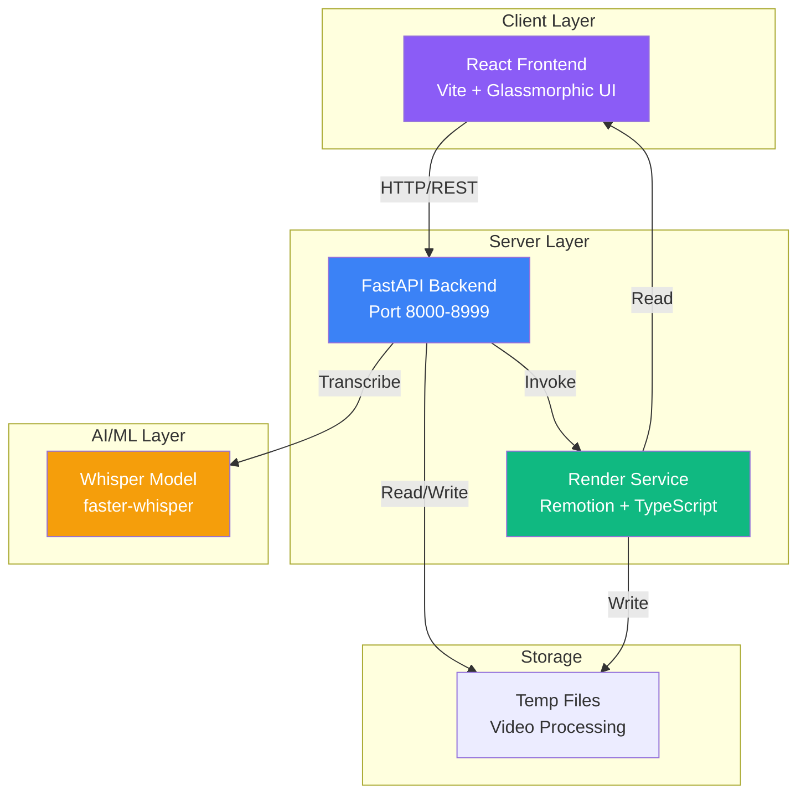
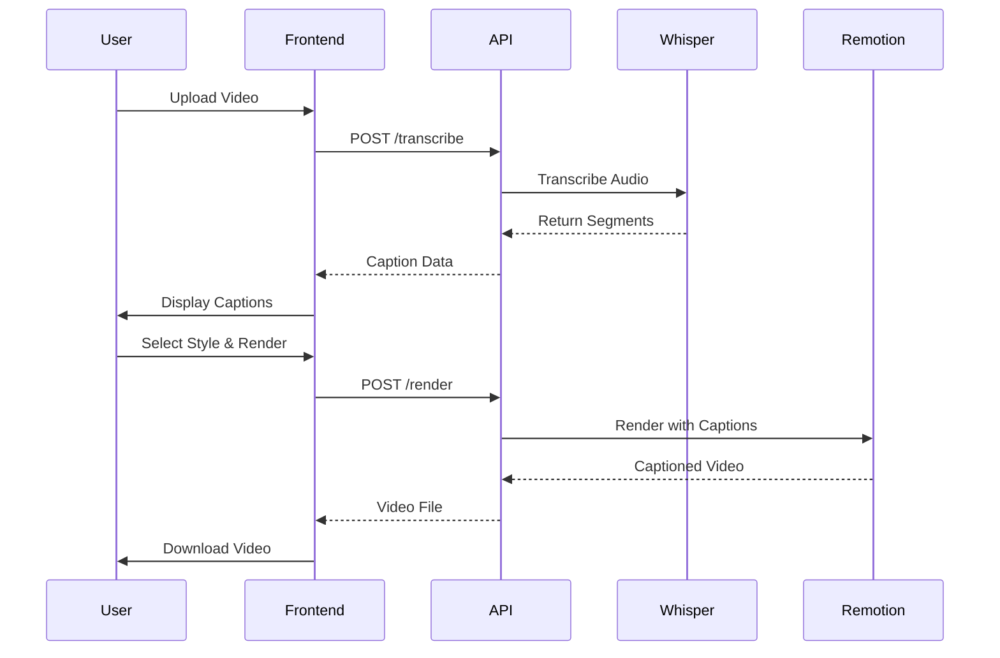

# Capsync - AI Video Captioning

<div align="center">


**Professional AI-powered video captioning with stunning modern UI**

[Features](#features) • [Tech Stack](#tech-stack) • [Quick Start](#quick-start) • [Architecture](#architecture) • [Deployment](#deployment)

</div>

---

## 📖 Overview

Capsync is a **premium, full-stack web application** that automatically generates and overlays captions on videos using OpenAI's Whisper AI model. Built with modern technologies and featuring a glassmorphic UI design, it showcases professional-grade architecture suitable for production deployment.

### ✨ Key Highlights

- 🎨 **Modern UI** - Glassmorphic design with gradient backgrounds
- 🤖 **AI-Powered** - OpenAI Whisper for accurate transcription
- 🎬 **Multiple Styles** - 3 caption styles (Bottom Centered, Top Bar, Karaoke)
- 🌐 **Multi-language** - English, Hindi, and Hinglish support
- 📱 **Responsive** - Works seamlessly on all devices
- ⚡ **Fast** - Optimized rendering with Remotion

---

## 🚀 Features

### Core Functionality
- **Automatic Transcription** - Upload videos and get accurate captions using Whisper AI
- **Multiple Caption Styles** - Choose from bottom-centered, top-bar, or karaoke-style captions
- **Caption Editing** - Fine-tune transcribed text before rendering
- **Fast Rendering** - Programmatic video rendering with Remotion
- **Progress Tracking** - Visual workflow with Upload → Generate → Customize → Download

### UI/UX Features
- **Glassmorphic Design** - Semi-transparent cards with backdrop blur
- **Gradient Backgrounds** - Vibrant purple-to-blue gradients
- **Smooth Animations** - 60fps transitions and micro-interactions
- **Dark/Light Modes** - Full theme support
- **Drag-and-Drop** - Intuitive file upload with visual feedback

---

## 🛠 Tech Stack

### Frontend
| Technology | Version | Purpose |
|------------|---------|---------|
| **React** | 18.3.1 | UI framework |
| **Vite** | 5.4.8 | Build tool & dev server |
| **Remotion** | 4.0.0 | Video composition |
| **@remotion/player** | 4.0.0 | Video preview |
| **Axios** | 1.7.7 | HTTP client |
| **Inter Font** | Latest | Professional typography |

**Key Features:**
- Modern React with hooks
- Hot Module Replacement (HMR)
- Fast build times with Vite
- Glassmorphic CSS with backdrop-filter
- CSS custom properties for theming

### Backend

#### API Service (Python)
| Technology | Version | Purpose |
|------------|---------|---------|
| **FastAPI** | 0.115.0 | REST API framework |
| **Uvicorn** | 0.30.6 | ASGI server |
| **faster-whisper** | 1.0.3 | Whisper AI implementation |
| **NumPy** | 1.23.0+ | Numerical processing |
| **python-multipart** | 0.0.9 | File upload handling |
| **FFmpeg** | 0.2.0 | Video processing |

**Key Features:**
- Async/await support
- Type hints with Pydantic
- Automatic API documentation
- CORS middleware
- Optimized Whisper inference

#### Render Service (TypeScript)
| Technology | Version | Purpose |
|------------|---------|---------|
| **Remotion** | 4.0.0 | Video rendering |
| **@remotion/renderer** | 4.0.0 | Server-side rendering |
| **TypeScript** | 5.6.2 | Type safety |
| **ts-node** | 10.9.2 | TypeScript execution |
| **yargs** | 17.7.2 | CLI argument parsing |

### Infrastructure
- **Node.js** - v16+ (Frontend & Render)
- **Python** - 3.11 (Backend API)
- **Whisper Models** - Cached ML models

---

## 🏗 Architecture

### System Architecture



### Component Architecture

```mermaid
graph LR
    subgraph "Frontend Components"
        UI[App.jsx<br/>Main Layout]
        UP[UploadZone<br/>File Input]
        VID[VideoPreview<br/>Player]
        STYLE[StyleSelector<br/>Caption Styles]
    end
    
    subgraph "API Endpoints"
        TR[/transcribe<br/>POST]
        REN[/render<br/>POST]
    end
    
    subgraph "Services"
        WH[Whisper Service<br/>Transcription]
        REM[Remotion Service<br/>Rendering]
    end
    
    UI --> UP
    UI --> VID
    UI --> STYLE
    
    UP -->|Upload Video| TR
    TR --> WH
    WH -->|Segments| VID
    
    STYLE -->|Style + Video| REN
    REN --> REM
    REM -->|Captioned Video| VID
    
    style UI fill:#8B5CF6,color:#fff
    style TR fill:#3B82F6,color:#fff
    style REN fill:#3B82F6,color:#fff
    style WH fill:#f59e0b,color:#fff
    style REM fill:#10b981,color:#fff
```

### Data Flow Diagram



### Directory Structure

```
capsync-5/
├── frontend/                 # React Application
│   ├── src/
│   │   ├── ui/              # UI Components
│   │   │   ├── App.jsx      # Main app component
│   │   │   ├── global.css   # Styles & theme
│   │   │   └── CaptionStyleSelector.jsx
│   │   └── video/           # Remotion compositions
│   │       ├── CaptionComposition.jsx
│   │       └── root.jsx
│   ├── index.html
│   ├── package.json
│   └── vite.config.js
│
├── backend/
│   ├── api/                 # FastAPI Server
│   │   ├── main.py          # API routes
│   │   └── requirements.txt
│   ├── services/
│   │   └── render/          # Remotion Rendering
│   │       ├── render.ts
│   │       ├── package.json
│   │       └── tsconfig.json
│   └── models/
│       └── whisper/         # ML Models
│
└── scripts/
    └── start.sh             # Startup script
```

---

## ⚡ Quick Start

### Prerequisites

- **Python 3.11** - For the backend API
- **Node.js 16+** - For frontend and rendering
- **Homebrew** (macOS) - For Python installation

### Installation

```bash
# Clone the repository
git clone https://github.com/ighackerbot/capsync.git
cd capsync

# Run the startup script
bash scripts/start.sh
```

The script will:
1. Create Python virtual environment
2. Install all dependencies
3. Start backend (port 8000-8999)
4. Start frontend (port 5173-5999)
5. Open browser automatically

### Manual Setup

#### Backend

```bash
cd backend/api
python3.11 -m venv .venv
source .venv/bin/activate
pip install -r requirements.txt
uvicorn main:app --host 127.0.0.1 --port 8000
```

#### Frontend

```bash
cd frontend
npm install
npm run dev
```

### Environment Variables

```bash
# Backend
export WHISPER_MODEL="small"        # Options: tiny, base, small, medium, large
export WHISPER_COMPUTE="int8"       # Compute type
export BACKEND_PORT=8000            # Custom backend port

# Frontend
export VITE_API_BASE="http://127.0.0.1:8000"  # Backend URL
export FRONTEND_PORT=5173                      # Custom frontend port
```

---

## 🌐 Deployment

### Quick Deploy to Google Cloud (Recommended) ⚡

Deploy both frontend AND backend to GCP Cloud Run with one script:

```bash
# One-command deployment
./deploy-gcp.sh
```

✨ **Why Google Cloud?**
- Auto-scaling (0 to N)
- Pay only for actual usage
- Enterprise-grade infrastructure
- Built-in HTTPS & CDN
- Free tier: 2M requests/month
- Global deployment

📖 **[Complete GCP Guide →](GCP_DEPLOYMENT.md)**

### Alternative Deployment Options

- **Cloud Run** - Containerized, serverless ([Guide](GCP_DEPLOYMENT.md#option-1-cloud-run-recommended))
- **App Engine** - Simple PaaS deployment
- **Vercel + Railway** - Hybrid ($5/month) ([Guide](HYBRID_DEPLOYMENT.md))
- **Docker** - Full containerization ([Guide](DEPLOYMENT.md#docker-deployment))
- **VPS** - Ubuntu + Nginx (Full control)

#### Create Dockerfile for Backend

```dockerfile
# backend/api/Dockerfile
FROM python:3.11-slim

WORKDIR /app

# Install system dependencies
RUN apt-get update && apt-get install -y \
    ffmpeg \
    && rm -rf /var/lib/apt/lists/*

# Copy requirements and install Python packages
COPY requirements.txt .
RUN pip install --no-cache-dir -r requirements.txt

# Copy application code
COPY . .

# Expose port
EXPOSE 8000

# Run the application
CMD ["uvicorn", "main:app", "--host", "0.0.0.0", "--port", "8000"]
```

#### Create Dockerfile for Frontend

```dockerfile
# frontend/Dockerfile
FROM node:18-alpine as builder

WORKDIR /app

# Copy package files
COPY package*.json ./
RUN npm ci

# Copy source code
COPY . .

# Build the application
RUN npm run build

# Production stage
FROM nginx:alpine
COPY --from=builder /app/dist /usr/share/nginx/html
COPY nginx.conf /etc/nginx/conf.d/default.conf

EXPOSE 80

CMD ["nginx", "-g", "daemon off;"]
```

#### Docker Compose

```yaml
# docker-compose.yml
version: '3.8'

services:
  backend:
    build: ./backend/api
    ports:
      - "8000:8000"
    environment:
      - WHISPER_MODEL=small
      - WHISPER_COMPUTE=int8
    volumes:
      - ./backend/models:/app/models

  frontend:
    build: ./frontend
    ports:
      - "80:80"
    environment:
      - VITE_API_BASE=http://backend:8000
    depends_on:
      - backend
```

```bash
# Deploy with Docker Compose
docker-compose up -d
```

---

### Option 2: Cloud Platform Deployment

#### Vercel (Frontend)

```bash
# Install Vercel CLI
npm install -g vercel

# Deploy from frontend directory
cd frontend
vercel --prod
```

**Environment Variables:**
- `VITE_API_BASE`: Your backend URL

#### Railway (Backend)

1. Connect GitHub repository to Railway
2. Select `backend/api` as root directory
3. Add environment variables:
   - `WHISPER_MODEL=small`
   - `PORT=8000`
4. Deploy

#### Render (Full-Stack)

**Backend Service:**
- Build Command: `pip install -r requirements.txt`
- Start Command: `uvicorn main:app --host 0.0.0.0 --port $PORT`
- Root Directory: `backend/api`

**Frontend Service:**
- Build Command: `npm install && npm run build`
- Start Command: `npm run preview`
- Root Directory: `frontend`

---

### Option 3: VPS Deployment (Ubuntu)

```bash
# Install dependencies
sudo apt update
sudo apt install -y python3.11 python3.11-venv nodejs npm ffmpeg nginx

# Setup backend
cd /var/www/capsync/backend/api
python3.11 -m venv .venv
source .venv/bin/activate
pip install -r requirements.txt

# Setup systemd service for backend
sudo nano /etc/systemd/system/capsync-backend.service
```

**Backend Service File:**
```ini
[Unit]
Description=Capsync Backend API
After=network.target

[Service]
User=www-data
WorkingDirectory=/var/www/capsync/backend/api
Environment="WHISPER_MODEL=small"
ExecStart=/var/www/capsync/backend/api/.venv/bin/uvicorn main:app --host 0.0.0.0 --port 8000

[Install]
WantedBy=multi-user.target
```

```bash
# Start backend service
sudo systemctl enable capsync-backend
sudo systemctl start capsync-backend

# Setup frontend
cd /var/www/capsync/frontend
npm install
npm run build

# Configure Nginx
sudo nano /etc/nginx/sites-available/capsync
```

**Nginx Configuration:**
```nginx
server {
    listen 80;
    server_name your-domain.com;

    location / {
        root /var/www/capsync/frontend/dist;
        try_files $uri $uri/ /index.html;
    }

    location /api {
        proxy_pass http://localhost:8000;
        proxy_set_header Host $host;
        proxy_set_header X-Real-IP $remote_addr;
    }
}
```

```bash
# Enable site and restart Nginx
sudo ln -s /etc/nginx/sites-available/capsync /etc/nginx/sites-enabled/
sudo systemctl restart nginx
```

---

## 🔒 Production Checklist

- [ ] Set up SSL/TLS certificates (Let's Encrypt)
- [ ] Configure CORS for production domain
- [ ] Set up environment variables securely
- [ ] Enable rate limiting on API
- [ ] Set up monitoring (Sentry, LogRocket)
- [ ] Configure CDN for static assets
- [ ] Set up database for user data (if adding auth)
- [ ] Enable GZIP compression
- [ ] Set up automated backups
- [ ] Configure firewall rules

---

## 📊 Performance

- **Build Time**: ~30s (frontend)
- **Cold Start**: ~2s (backend)
- **Transcription**: ~0.3x realtime (for "small" model)
- **Rendering**: ~1-2min for 1min video
- **Bundle Size**: ~800KB (frontend, gzipped)

---

## 🤝 Contributing

Contributions are welcome! Please:

1. Fork the repository
2. Create a feature branch (`git checkout -b feature/AmazingFeature`)
3. Commit changes (`git commit -m 'Add AmazingFeature'`)
4. Push to branch (`git push origin feature/AmazingFeature`)
5. Open a Pull Request

---

## 📝 License

This project is licensed under the MIT License.

---

## 🙏 Acknowledgments

- **OpenAI Whisper** - For the amazing speech recognition model
- **Remotion** - For programmatic video generation
- **FastAPI** - For the high-performance backend framework

---

## 📧 Contact

**Project Link**: [https://github.com/ighackerbot/capsync](https://github.com/ighackerbot/capsync)

---

<div align="center">

Made with ❤️ using React, FastAPI, and Whisper AI

⭐ Star this repo if you find it helpful!

</div>
